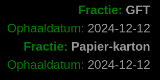

# MMM-Recyclecollection

MMM-Recyclecollection is een module voor de [MagicMirror](https://github.com/MagicMirrorOrg/MagicMirror).

De correcte straatinformatie moet worden aangevuld in de `node_helper`. (postcode, straat, nr)
Zie hiervoor in de bijgevoegde csv (in de zip) en gebruik de huidige helper als referentie.

Toont de volgende ophaaldagen voor Diftar via Recycleapp.be API.

Ontwikkeld in Node.js en geport naar MagicMirror.

## Screenshot



## Installation

```bash
cd ~/MagicMirror/modules
git clone https://github.com/dierckxtom/MMM-Recyclecollection
```

## Update

*Note:* Backup your changes to the `node_helper.js` if you have made any changes before updating.

```bash
cd ~/MagicMirror/modules/MMM-Recyclecollection
git reset --hard
git pull
```

## Configuration

```js
  {
    module: "MMM-Recyclecollection",
    position: "top_right", // You can place it anywhere on the screen
    config: {
      // You can add additional configuration here if needed
    }
  },
```
